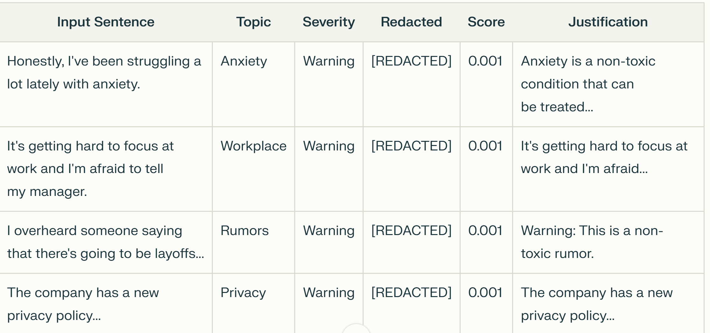

# EchoFilter: AI-Powered Personal Audio Firewall

**EchoFilter** is an intelligent desktop application that acts as a "personal audio firewall," protecting your privacy by automatically listening to and analyzing ambient audio—such as meetings, calls, or recordings—to detect, flag, and redact sensitive or inappropriate content in real time.

Powered by advanced open-source AI models, EchoFilter goes beyond simple keyword spotting. It understands context and meaning, allowing it to identify sensitive topics, personal information, or policy violations—even when they are mentioned obliquely or paraphrased. All processing is done locally on your machine, ensuring your data and conversations remain private and secure.

**Key Features:**
- Accepts audio/video files, live microphone input, or direct text.
- Transcribes speech to text using Whisper ASR.
- Lets you define custom sensitive topics (e.g., health, finance, NDA, profanity).
- Uses large language models to semantically classify and flag content.
- Redacts or summarizes flagged content for safe sharing.
- Provides detailed justifications for every flag or redaction.
- Exports results as structured JSON for compliance or auditing.

**Typical Use Cases:**
- Ensuring compliance with privacy policies in meetings or calls.
- Preventing accidental sharing of confidential or personal information.
- Creating safe, shareable transcripts from sensitive recordings.

*EchoFilter is open-source, fully local, and designed for anyone who values privacy and responsible communication in the digital age.*

# Objective
The objective of EchoFilter is to provide a smart, AI-powered audio firewall that protects user privacy and ensures compliance by automatically monitoring, transcribing, and analyzing spoken content from audio, video, or live recordings.

EchoFilter is designed to:
- Detect and flag sensitive topics, trigger words, or personal information as defined by the user (such as health, finance, NDA, profanity, etc.).
- Go beyond simple keyword matching by using advanced language models to understand the context and semantic meaning of conversations—even when sensitive information is mentioned indirectly.
- Classify each segment of speech as safe, warning, or critical, and provide clear justifications for each decision.
- Redact or summarize flagged content, making transcripts safe for sharing or archiving.
- Operate fully locally, ensuring user data and conversations remain private and secure.

This tool is ideal for anyone who needs to monitor and control the flow of sensitive information in meetings, calls, or recordings—whether for personal privacy, organizational compliance, or safe content sharing.

## Features

- Multi-Modal Input Support
  - Attach and analyze audio or video files in various formats (.mp3, .wav, .mp4, etc.)
  - Record live audio directly from your microphone within the app
- Automatic Speech Recognition (ASR)
  - Transcribes speech to text using the open-source Whisper model for accurate, local, and private transcription
- Punctuation Restoration
  - Enhances readability and downstream analysis by restoring punctuation to raw ASR transcripts using the DeepMultilingualPunctuation model
- Sensitive Topic Detection
  - Accepts user-defined, comma-separated sensitive topics (e.g., Health, NDA, Profanity, Finance)
  - Classifies each sentence semantically into one of the provided topics using the FLAN-T5 large language model
- Toxicity Analysis
  - Detects and scores toxic language in each sentence with the Unitary Toxic-BERT model
- Severity Assessment
  - Assigns each sentence a severity level: Safe (no issue), Warning (potentially sensitive), Critical (highly sensitive or toxic)
- Redaction and Safe Sharing
  - Automatically redacts sentences marked as "Warning" or "Critical" or those with high toxicity, making transcripts safe for sharing
- Justification Generation
  - Provides a concise, AI-generated explanation for each classification and redaction decision
- Interactive Desktop GUI
  - User-friendly interface built with Tkinter for attaching files, recording audio, viewing results, and saving output
- Exportable Results
  - Save detailed analysis results (including original, redacted, topics, severity, toxicity scores, and justifications) as structured JSON files
- Fully Local and Private
  - All processing is performed locally on your machine for maximum privacy—no data is sent to external servers or cloud APIs

## System Architecture & Design
**High-Level Workflow**
-Input Acquisition
 -Attach Audio/Video File: Users can select files in various formats (.mp3, .wav, .mp4, etc.).
 -Record Live Audio: Users can record audio directly from their microphone.
-Audio Extraction & Preprocessing
 -FFmpeg: Extracts and converts audio from video files to a standardized format for transcription.
-Speech-to-Text (ASR)
 -Whisper Model: Transcribes audio to text locally, ensuring privacy and supporting multiple languages.
 -This project uses the open-source Whisper transcription model from OpenAI, running locally via the Python package—not through any closed API service.
-Punctuation Restoration
 -DeepMultilingualPunctuation Model: Adds punctuation to raw ASR output, improving readability and enabling accurate sentence splitting.
-Sentence Segmentation
 -The punctuated transcript is split into individual sentences for granular analysis.
-Sensitive Topic Classification
 -FLAN-T5 Large (via Hugging Face Transformers): Each sentence is semantically classified into a user-provided list of sensitive topics.
-Toxicity Detection
 -Unitary Toxic-BERT: Each sentence is analyzed for toxic language and assigned a toxicity score.
-Severity Assessment & Redaction
 -Sentences are labeled as Safe, Warning, or Critical based on topic and toxicity.
 -Sentences marked as Warning, Critical, or toxic are redacted for safe sharing.
-Justification Generation
 -FLAN-T5 Large: Generates a concise explanation for each classification and redaction.
-Output & Export
 -Results (including original, redacted, topics, severity, toxicity, and justifications) are displayed in the GUI and can be exported as JSON.

+---------------------+
|   User Interface    |
+---------------------+
      |
      v
      # Tkinter GUI (file select, record, analyze, save)

+---------------------+
|    Audio Input      |
+---------------------+
      |
      v
      # Record audio / Attach audio, video

+---------------------+
|  Audio Extraction   |
+---------------------+
      |
      v
      # FFmpeg

+---------------------+
|  Speech-to-Text     |
+---------------------+
      |
      v
      # Whisper (local ASR) (raw text)

+-------------------------------+
|   Punctuation Restoration     |
+-------------------------------+
      |
      v
      # DeepMultilingualPunctuation

+---------------------+
| Sentence Splitting  |
+---------------------+
      |
      v

+---------------------+
|    NLP Analysis     |
+---------------------+
      |
      v
      # - Topic Classify: FLAN-T5 (transformers)
      # - Toxicity Score: Toxic-BERT
      # - Severity Assign
      # - Redaction
      # - Justification: FLAN-T5

+---------------------+
|   Results Output    |
+---------------------+
      |
      v
      # Display in GUI, export as JSON

## Installation & Dependencies
**Install Required Packages**
 -Option 1: In Your Terminal or Command Prompt
 pip install sounddevice scipy numpy whisper deepmultilingualpunctuation transformers torch transformers ffmpeg
 -Option 2: Directly in a Jupyter Notebook Cell
 -!pip install sounddevice scipy numpy whisper deepmultilingualpunctuation transformers torch transformers
 -Note:
  -tkinter is usually bundled with Python. If you get an import error, install it via your system’s package manager.
 -FFmpeg Installation
  -FFmpeg is required for audio/video processing.
-check 
 -ffmpeg -version
 
**Model Downloads**
On first run, these models are downloaded automatically:
Whisper – Speech Recognition
FLAN-T5 – Text Classification
Toxic-BERT – Toxicity Detection
DeepMultilingualPunctuation – Punctuation Restoration

-Model not downloading?
 -Check your internet connection.
-tkinter error?
 -Try running your script outside Jupyter.
 
**Usage Guide**
🚀 Usage Guide (Jupyter Notebook)
Follow these steps to analyze audio or video content for sensitive topics and toxicity using EchoFilter in a Jupyter notebook:

1. Install Required Packages
In a notebook cell, run:

python
!pip install sounddevice scipy numpy whisper deepmultilingualpunctuation transformers torch
If you get an error for tkinter, you may need to install it via your system’s package manager (outside the notebook).

2. Import and Initialize
Copy all the code from your notebook (including model loading and helper functions) into the first notebook cell.

Run the cell to initialize all imports and models.

3. Analyze Audio or Video
Attach Audio/Video File:
Use the file dialog in your GUI (if you run the Tkinter app from a notebook cell), or use notebook code to specify the file path.

Record Live Audio:
Use the provided function in your notebook to record and process audio.

4. View and Analyze the Transcript
After processing, the transcript will be displayed in your notebook output or GUI window.

Use the provided functions to:

Restore punctuation

Split into sentences

Classify sentences by topic

Detect toxicity

Redact sensitive/toxic sentences

Generate justifications

5. Review and Save Results
Results will be displayed in the output area or GUI.

Use the save_results_to_json() function to export your analysis as a .json file.

6. Tips & Troubleshooting
If you see errors about missing packages, run !pip install package-name in a notebook cell.

If you see errors about missing models, check your internet connection.

If you see tkinter errors, try running the script in a standard Python environment (outside Jupyter), as GUIs may not work in all notebook setups.

Note:

If you want to use the full Tkinter GUI, it is best to run your script as a standard Python script (python your_script.py) from the terminal, since GUIs are not always supported in Jupyter notebooks.

**Sample Output (JSON)**
📌 Enter sensitive topic labels (comma-separated):
 Mental Health, Depression, Anxiety, NDA, Privacy, Company Policy, Politics, Government, Reform, Harassment, Workplace, Ethics, Data Protection, Security, Environment, Climate Change, Sustainability, Rumors, Job Security, Humor, Casual, Social, Health, Medicine, Public Safety, Discrimination, Social Justice

🥾 Cleaned Text:
did you see the post on the internal forum about the CEOs political donations? things are getting tense.

🔹 [REDACTED]
   → Original: Did you see the post on the internal forum about the CEOs political donations?
   → Topic: Politics | Severity: Warning | Score: 0.001
   → Justification: The post on the internal forum was about the CEOs political donations. The post was a warning.

🔹 [REDACTED]
   → Original: Things are getting tense.
   → Topic: Anxiety | Severity: Warning | Score: 0.001
   → Justification: The non-toxic label is for anxiety.

**Testing & Evaluation**
1. Functional Testing
Sample Data:
Use the provided sample transcript or your own audio/video files to test the full pipeline.

Steps:
Run the notebook cells or GUI as described in the Usage Guide.
Attach or record an audio/video file.
Enter a list of sensitive topics (e.g., NDA, Finance, Profanity).
Verify that:
The transcript is generated correctly.
Sentences are punctuated and split properly.
Topics are classified as expected.
Toxicity scores are reasonable.
Redactions occur for sensitive or toxic content.
Justifications are generated for each decision.
Results can be exported as JSON.

